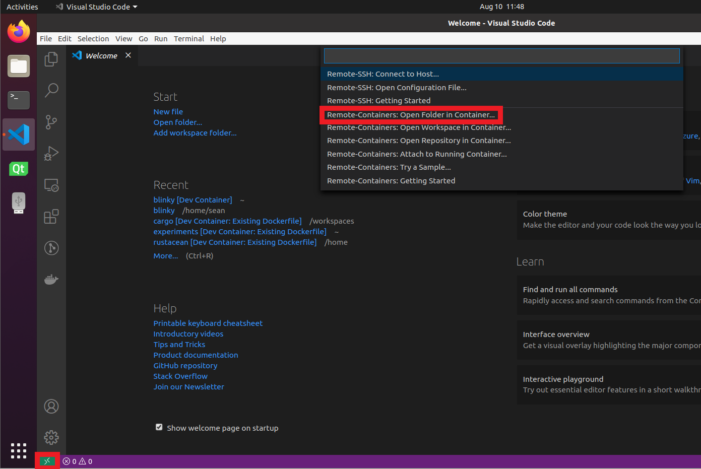
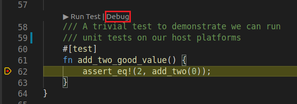

# Blinky
A simple starting project for bare metal rust projects. This repository ships with an environment that allows cross compilation, flashing the target device, remote debugging, local unit testing, and local debugging for unit tests. The environment was created with a [STM32F429I Discovery Board](https://www.st.com/content/st_com/en/products/evaluation-tools/product-evaluation-tools/mcu-mpu-eval-tools/stm32-mcu-mpu-eval-tools/stm32-discovery-kits/32f429idiscovery.html) in mind but can be easily configured to accomidate a different device. The remainder of the readme shall provide instructions for how to get the environment up and running, how to use the tools, provide narative for how the environment was architected and point to additional embedded rust resources.

Note: Much of the environment setup has been automated using docker following the instructions in the [embedded rust discovery book](https://rust-embedded.github.io/discovery/).

# Requirements
 - A linux development environment
 - [Docker](https://docs.docker.com/engine/install/)
 - [VSCode](https://code.visualstudio.com/)
 - VSCode Extention: [Remote - Containers](https://marketplace.visualstudio.com/items?itemName=ms-vscode-remote.remote-containers)

The remaining instructions will assume you have these requirements correctly installed.

# Setup
1. In your linux environment, create a udev rule following the instructions [here](https://rust-embedded.github.io/discovery/03-setup/linux.html#udev-rules). 

    Notes
    - The udev rule allows the target device to be flashed without root privlages.
    - It is convient, but not required, to create a symbolic link to your device using the `SYMLINK` key. This allows you to refer to your device under a static name rather than dynamic numbers.
    - The udev rule used for the ST on board debugger was specified in the `/etc/udev/rules.d/99-openocd.rules` file and is as follows
        ```
        # STM32F3DISCOVERY rev A/B - ST-LINK/V2
        ATTRS{idVendor}=="0483", ATTRS{idProduct}=="3748", MODE:="0666", SYMLINK+="ST-LINK-V2"

        # STM32F3DISCOVERY rev C+ - ST-LINK/V2-1
        ATTRS{idVendor}=="0483", ATTRS{idProduct}=="374b", MODE:="0666", SYMLINK+="ST-LINK-V2-1"
        ```
    Your udev rule may differ if you are not using ST Hardware.

2. Open VSCode.

3. Open the repository within a remote container by selecting the green `><` icon in the bottom left corner and select `Remote-Containers: Reopen in Container`. 

4. Select the directory containing the `Dockerfile` of this repository. VSCode should reopen and begin building the docker image for the environment. This can take up to 5 minutes the first time.

Congratulations. You should now have a fully functional envrionment.

# Environment Overview
Most of the configurable items within this repository are in the `scripts` directory. These scripts simply serve as a way of centralizing most configurable items and allowing many tasks (such as linting and debugging) to require minimum setup and be highly configurable. 

# Building and Running
You can build and deploy the application to the target device using `cargo run`.

# Unit testing
- To compile and run unit tests on your local machine run
    ``` 
    cargo test --target x86_64-unknown-linux-gnu
    ```

    Alternatively you can use a script that runs this command for you.
    ```
    ./scripts/run_unit_tests.sh
    ```

- You can also build the unit tests without running them using 
    ```
    cargo test --target x86_64-unknown-linux-gnu --no-run
    ```
    or running
    ```
    ./scripts/build_unit_tests.sh
    ```

    Building unit tests without running them can be usefull sometimes for debugging and code coverage purposes.

# Debugging Remote Devce
In VSCode, press the debugger icon, select `Debug Microcontroller`, and press the play button.


This will load the program and stop at your first manual breakpoint. Note you need to make sure you compile before you use this debugger.

# Debugging Unit tests locally
In VSCode, press the debugger icon, select `Debug Unit Tests`, and press the play button.


Unlike debugging the micro controller, you don't need to compile the executible yourself. Pressing the play button will cause the unit tests to get re-compiled before the tests are run.

# Configuration Files
A brief description of configuration files for the environment and what fields that may need to change from project to project.

- [.cargo/config.toml](https://doc.rust-lang.org/cargo/reference/config.html) - Specifies default arguments to cargo when you run `cargo build` and `cargo run`. 

    `target` will likey change between projects depending on the hardware. See
    https://forge.rust-lang.org/release/platform-support.html for a list of supported platforms.

- [devcontainer.json](https://aka.ms/vscode-remote/devcontainer.json) - Specifies how the docker container should be run and VSCode extentions to be installed.

    `extentions` may change between projects.

    `postStartCommand` specifies the interface and target for the debugger. The interface and target must change between projects. See
    https://github.com/ntfreak/openocd/blob/master/README for valid interface and target options.


- [.vscode/launch.json](https://go.microsoft.com/fwlink/?linkid=830387) - Stores configurations for running the debuggers.

- [Dockerfile](https://docs.docker.com/engine/reference/builder/) - Specifies tools to be installed in the environment.
- `memory.x` - information specifying memory layout of the board.
    
    `memory.x` for the board can usually be found on github. See...
    
    https://github.com/stm32-rs

    https://github.com/nrf-rs/nrf-hal

- `run.gdb` - Specifies initial gdb commands to run when `cargo run` is used.

# Additional Resources

- [Rust Embedded Discovery](https://rust-embedded.github.io/discovery/) - Documentation automated for environment setup. Awesome projects to try and implement yourself to become a master rustacean.

- [Microrust](https://droogmic.github.io/microrust/appendix/troubleshooting.html) - Another beginner friendly book with helpful troubleshooting steps with GDB and openGCD.

- [The Embedded Rust Book](https://rust-embedded.github.io/book/) - Assumes expierence with embedded systems and Rust. Good resource for interoperability between Rust and C.

- [The Rustonomicon](https://doc.rust-lang.org/nightly/nomicon/) - Discusses unsafe rust. Particaulary useful charpters are `Data Layout` and `Beneath std`.

- [A Guide to Porting C and C++ code to Rust](https://locka99.gitbooks.io/a-guide-to-porting-c-to-rust/content/) 

- [The Cargo Book](https://doc.rust-lang.org/cargo/) - Great resource for how to create different builds.

- [Writing udev rules](http://www.reactivated.net/writing_udev_rules.html) - The ins and outs of udev rules.

- [awesome-embedded-rust](https://github.com/rust-embedded/awesome-embedded-rust) - A curated and maintained list of embedded rust resources. Great place to periodically check for new developments and off the shelf solutions.